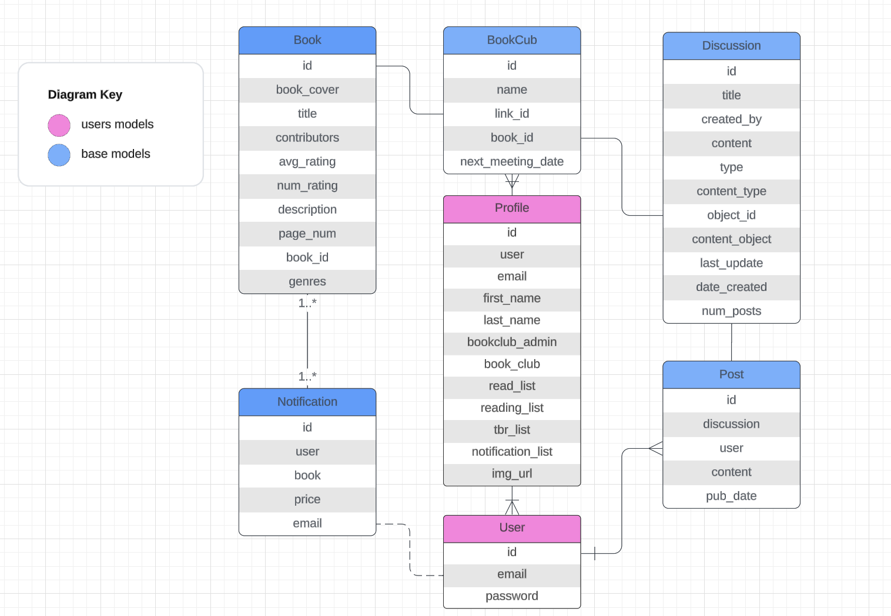

# Writing in the Margins

Discuss your next good read

## Table of Contents

- [Description](#description)
- [Installation](#installation)
- [Usage](#usage)
- [Contributing](#contributing)
- [License](#license)

## Description

Welcome to _Writing in the Margins_, your ultimate destination for managing your reading journey and discovering new books! With _Writing in the Margins_, you can effortlessly navigate through the literary world with a plethora of features tailored to enhance your reading experience:

- Search and Discover: Dive into a vast collection of books sourced from Goodreads, where you can explore various genres, authors, and titles to find your next captivating read.

- Organize Your Reading: Seamlessly manage your reading lists by categorizing books into "To Read," "Reading," "Read," and "Want to Buy." Keep track of your progress and prioritize your reading goals effortlessly.

- Join Book Clubs: Connect with fellow book enthusiasts by joining book clubs within the platform. Engage in discussions, share recommendations, and broaden your literary horizons in a vibrant community of readers.

- Book Descriptions: Access comprehensive book descriptions, reviews, and ratings to make informed decisions about your reading choices. Get a glimpse into the plot, characters, and themes before diving into your next adventure.

- Price Drop Alerts: Stay updated on the latest deals and discounts with our price drop alert feature. Receive email notifications when the price of your favorite books on Amazon falls below your specified threshold, ensuring you never miss out on a great deal.

With _Writing in the Margins_, embark on a personalized reading journey tailored to your preferences, interests, and reading goals. Whether you're an avid reader seeking your next literary obsession or a casual reader exploring new genres, _Writing in the Margins_ is your ultimate companion in the world of books. Join us and let the reading adventures begin!

## Installation

1. Fork and clone this repository.

2. Set up a `.env` file and add the following:

- `SECRET_KEY = "YOUR_DJANGO_SECRET_KEY"`
- `DB_NAME = "YOUR_DB_NAME"`
- `DB_USER = "YOUR_DB_USER"`
- `DB_PASSWORD = "YOUR_DB_PASS"`
- `DB_HOST = "localhost"`
- `DB_PORT = 5432`
- `SCRAPEOPS_API_KEY = "YOUR_SCRAPEOPS_API_KEY"`

3. On your PostgresSQL create a database with the schema.sql included on this project.

- Depending on how your PostgreSQL is setup, you might have to edit the values on the .env file. This file usually should be not included in repositories since it contains sensitive information but since this is mainly for demonstration adding the file shouldn't be a big deal.

4. Run the following commands from your terminal while inside of the project's directory:

- `python -m pip install -r requirements.txt`

- `cd bookclub`

- `python manage.py makemigrations`

- `python manage.py migrate`

- `python manage.py crawl`

## Usage

- `python manage.py runserver`

- `python manage.py tailwind start`

- `./tailwindcss -i static/css/input.css -o static/css/output.css --watch`

## User Stories

- As a user I can create an account
- As a user I can view and edit my profile information
  - Stretch Goal: Allow users to upload profile photos
- As a user I search for and view book data
- As a user I can add books to read, currently reading, want to read, and watch lists
- As a user I can join a book club
  - Stretch Goal: Allow users to create their own book club
- As a user I can participate in book discussions
  - Users can create new responses and delete their own responses
- As a user I can choose bookclub books (admin) or suggest books (non-admin)

BIG STRETCH GOAL:

- Email users when price drops below watch list price

## DATABASE ERD

## WIREFRAMES

## STACK USED

- Django
- Postgres
- Tailwind CSS
- Scrapy
- ScrapeOps

# Challenges

- Running the data scraper more than once.
- Changing the class/styling of a dynamically generated element.
- Implementing a loading screen while the spider runs.
